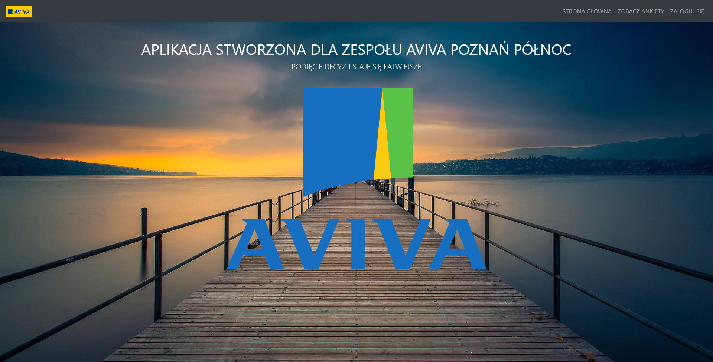

# VoteApp
> Application for the employees from Aviva Ubezpieczenia - II Oddział w Poznaniu.

## Table of contents
* [General info](#general-info)
* [Technologies](#technologies)
* [Setup](#setup)
* [Features](#features)
* [Status](#status)
* [Contact](#contact)
* [Screenshots](#screenshots)

## General info

## Technologies
* Django
* PostgreSQL
* Bootstrap
* JavaScript

## Setup
You need to have python3 installed. In project folder: 
* `pip3 install -r requirements.txt`
* `python manage.py runserver`

## Features
* Authorization - login, registration
* Reset password sending for email
* Voting
* Creating polls
* realtime charts creater with Js

## Status
Project is: _inProgress_

## Contact
Created by Pawel Rozplochowski

## Screenshots

.png)
.png)
.png)

